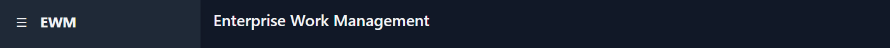
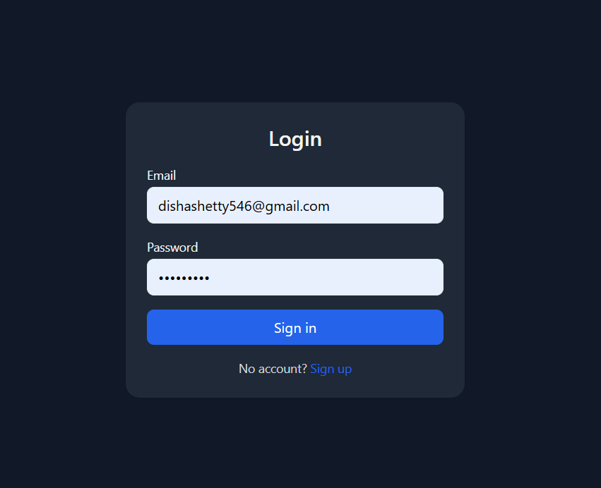
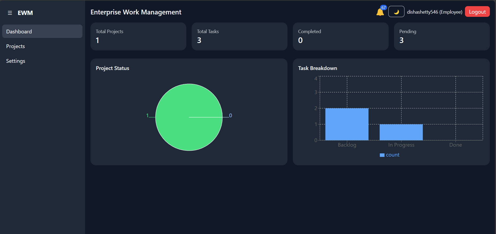
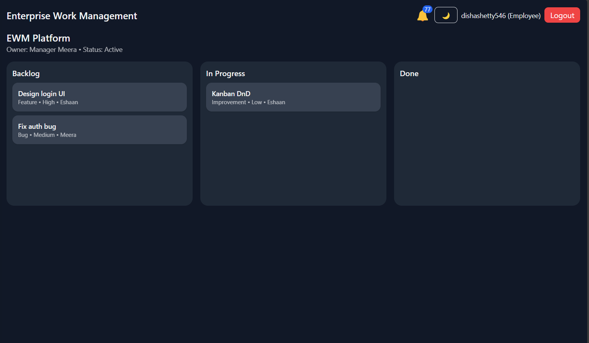
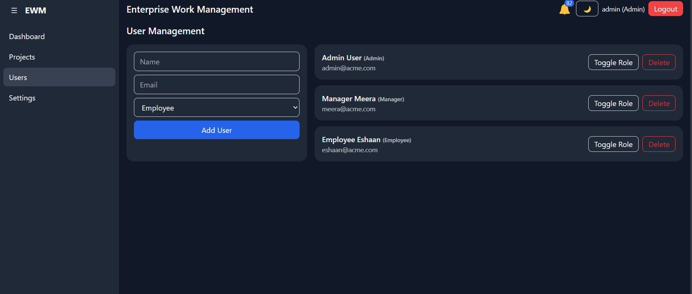
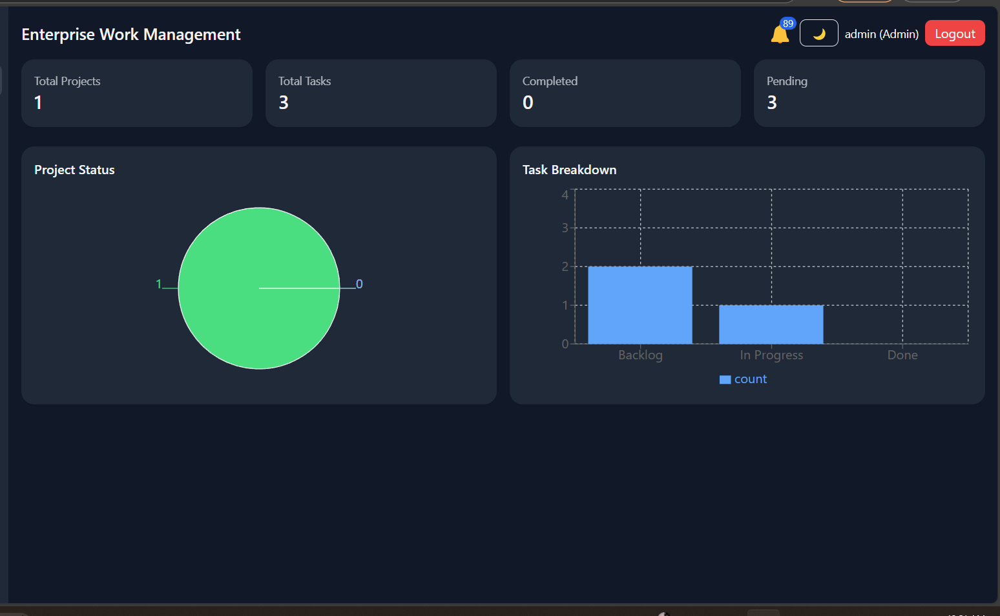

# Enterprise Work Management System (EWM)



## Table of Contents

- [Project Overview](#project-overview)
- [Features](#features)
- [Tech Stack](#tech-stack)
- [Installation & Setup](#installation--setup)
- [Usage](#usage)
- [Screenshots](#screenshots)
- [Testing](#testing)
- [Deployment](#deployment)
- [Project Structure](#project-structure)
- [Contributing](#contributing)
- [License](#license)

---

## Project Overview

The **Enterprise Work Management System (EWM)** is a modular, scalable, and production-ready web application built with React.  
It is designed to manage projects, tasks, users, and analytics in a professional enterprise environment, supporting multiple roles and real-time collaboration.

Key goals:

- Provide secure authentication and role-based access.
- Efficiently manage projects, tasks, and user workflows.
- Visualize project and task data through dashboards and reports.
- Enable real-time updates and notifications.

---

## Features

### 1. User Authentication & Roles

- Login/Signup with JWT authentication
- User roles: **Admin, Manager, Employee**
- Role-based route protection for secure navigation

### 2. Dashboard

- Project & Task metrics: Total, Completed, Pending
- Recent activity feed for all users
- Notifications panel with real-time updates

### 3. Project & Task Management

- Create, assign, edit, and delete projects and tasks
- Kanban board with drag-and-drop (react-beautiful-dnd)
- Task types: Bug, Feature, Improvement
- Support for due dates, priorities, comments, and file attachments

### 4. User Management

- Admin-only access to CRUD users
- Display user roles, last activity, and account status

### 5. Reporting & Analytics

- Generate project status reports
- Visualize data using charts (Recharts / Chart.js)

### 6. Notifications

- Toast alerts for important actions (react-toastify)
- Real-time updates using WebSockets

### 7. Settings

- Dark/light theme toggle (persisted using localStorage)
- Profile editing and password change

---

## Tech Stack

- **Frontend:** React (Functional Components + Hooks), TailwindCSS
- **State Management:** Redux Toolkit
- **Routing:** React Router v6
- **Forms & Validation:** React Hook Form + Yup
- **HTTP Requests:** Axios
- **Charts & Analytics:** Recharts / Chart.js
- **Notifications:** react-toastify
- **Testing:** Jest + React Testing Library
- **Deployment:** Vercel / Netlify

---

## Installation & Setup

### Prerequisites

- Node.js v20+
- npm v9+

### Steps

1. Clone the repository

```bash
git clone https://github.com/<your-username>/enterprise-work-management.git
cd enterprise-work-management
```

2. Install dependencies

```bash
npm install
```

3. Start the development server

```bash
npm start
```

4. Open in browser

```bash
http://localhost:3000
```

## 🛠 Usage

You can log in with the following demo credentials to explore the application:

- **Admin**  
  Email: `admin@acme.com`  
  Password: `secret123`

- **Manager**  
  Email: `manager@acme.com`  
  Password: `secret123`

- **Employee**  
  Email: `employee@acme.com`  
  Password: `secret123`

### Role-Based Actions

- **Admin**

  - Manage users
  - Manage projects
  - Manage tasks

- **Manager**

  - Assign tasks
  - View reports

- **Employee**
  - Update task status
  - View assigned tasks

## Screenshots

Below are some key screens of the application.  
_(Replace the sample image paths with actual screenshots from your project.)_

---

### Login Page

The login page allows users to securely sign in with their credentials.  


---

### Dashboard

The dashboard gives an overview of tasks, activities, and quick stats for easy navigation.  


---

### Kanban Board

The Kanban board helps in managing tasks visually with drag-and-drop functionality.  


---

### User Management

Admins can manage user accounts, roles, and permissions from this section.  


---

### Reports & Analytics

This section provides insights through charts and reports for better decision-making.  


## Testing

Run unit and integration tests with the following command:

```bash
npm test
```

To generate a coverage report

```bash
npm test -- --coverage
```

- Login Component – validation and authentication flow
- Project Creation Flow – creating and displaying new projects
- Kanban Task Updates – task movement across board columns
- User Management CRUD – create, update, delete, and list users
- Dashboard Metrics – rendering and updating key performance indicators

## Contributing

Contributions are welcome! Follow the steps below to contribute:

1. **Fork the repository**

2. **Create a feature branch**

```bash
   git checkout -b feature-name
```

```bash
   git commit -m "Add feature"

```

```bash
   git push origin feature-name

```
